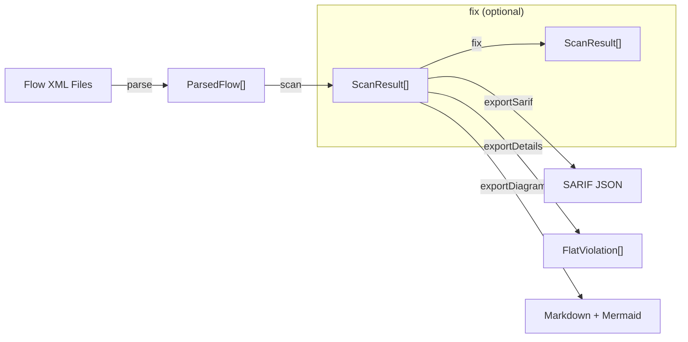
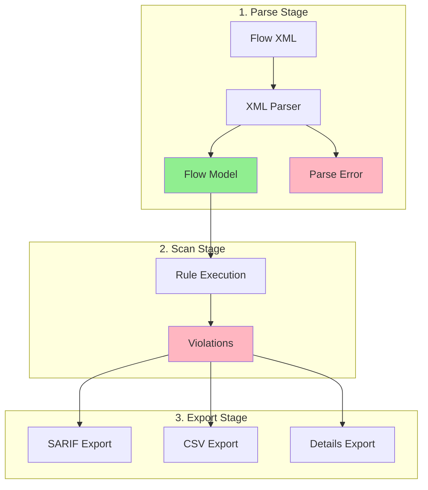
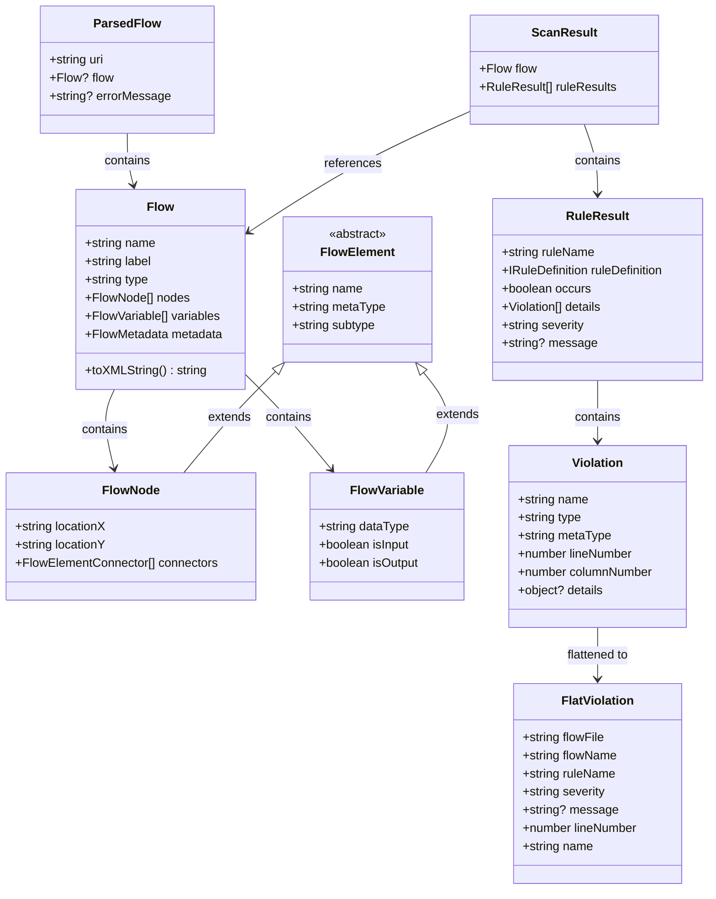

# Core Library Reference

This document is intentionally developer-focused, providing the technical depth needed for core library users such as Programmatic API, types, and advanced usage of `@flow-scanner/lightning-flow-scanner-core`.

## Table of Contents

- [Architecture Overview](#architecture-overview)
- [Data Flow](#data-flow)
- [Model Relationships](#model-relationships)
- [Core Models](#core-models)
- [Functions](#functions)

## Architecture Overview

The Lightning Flow Scanner core engine follows a pipeline architecture:



## Data Flow

The scanner processes flows through several stages:



## Model Relationships

The core models form a hierarchical structure representing Salesforce Flow metadata:



## Core Models

### ParsedFlow

The result of parsing a flow XML file. Contains either a successfully parsed `Flow` or an `errorMessage` if parsing failed.

**Key Properties:**
- `uri`: File path or identifier
- `flow`: Successfully parsed Flow model (if no error)
- `errorMessage`: Parse error details (if parsing failed)

**Usage:**
```typescript
const parsedFlows = await parse(['path/to/flow.flow-meta.xml']);
// Filter successful parses
const successfulFlows = parsedFlows.filter(pf => pf.flow && !pf.errorMessage);
```

### Flow

The main model representing a Salesforce Flow. Contains all metadata, nodes, variables, and resources.

**Key Properties:**
- `name`: API name of the flow
- `label`: User-friendly label
- `type`: Flow type (AutoLaunchedFlow, Screen, RecordTriggeredFlow, etc.)
- `nodes`: Array of flow elements (actions, decisions, loops, etc.)
- `variables`: Array of flow variables
- `metadata`: Flow-level metadata (processType, triggerOrder, etc.)
- `graph`: Computed graph structure for flow analysis

**Key Methods:**
- `toXMLString()`: Serializes back to XML format
- `getElementByName(name)`: Finds specific element

### FlowElement (Abstract Base)

Base class for all flow elements (nodes, variables, resources).

**Key Properties:**
- `name`: Unique identifier
- `metaType`: Type category (NODE, VARIABLE, ATTRIBUTE, etc.)
- `subtype`: Specific type (recordCreate, formula, textTemplate, etc.)

**Derived Classes:**
- `FlowNode`: Visual elements (actions, decisions, loops, etc.)
- `FlowVariable`: Flow variables and constants
- `FlowResource`: Formulas, text templates, choices
- `FlowAttribute`: Flow-level attributes

### ScanResult

The result of scanning a single flow against all rules.

**Key Properties:**
- `flow`: Reference to the scanned Flow
- `ruleResults`: Array of results from each executed rule

**Usage:**
```typescript
const results = scan(parsedFlows, { rules: { ... } });
results.forEach(scanResult => {
  console.log(`Flow: ${scanResult.flow.name}`);
  console.log(`Issues found: ${scanResult.ruleResults.filter(r => r.occurs).length}`);
});
```

### RuleResult

The result of executing a single rule against a flow.

**Key Properties:**
- `ruleName`: Rule identifier
- `ruleDefinition`: Full rule metadata
- `occurs`: Whether violations were found
- `details`: Array of specific violations
- `severity`: error | warning | note
- `message`: Custom message overriding default description

### Violation

An individual violation found by a rule.

**Key Properties:**
- `name`: Name of the violating element
- `type`: Element type
- `metaType`: Metadata type category
- `lineNumber`: Line number in XML (enriched during scan)
- `columnNumber`: Column number in XML (enriched during scan)
- `details`: Additional context (dataType, locationX/Y, expression, etc.)

### FlatViolation

Flattened representation of a violation for export formats (CSV, tables).

**Key Properties:**
- All Violation properties (flattened)
- `flowFile`: File path
- `flowName`: Flow name
- `ruleName`: Rule that found the violation
- `severity`: Issue severity
- `message`: Rule description or custom message

**Usage:**
```typescript
const flatViolations = exportDetails(scanResults, true);
// Export to CSV, display in tables, etc.
```

## Usage Examples

Here's a complete example showing how the models flow through the scanner:

```typescript
import * as core from '@flow-scanner/lightning-flow-scanner-core';

// 1. PARSE: Load flows from file system (Node.js only)
const parsedFlows: ParsedFlow[] = await core.parse([
  'force-app/main/default/flows/MyFlow.flow-meta.xml'
]);

// Check for parse errors
parsedFlows.forEach(pf => {
  if (pf.errorMessage) {
    console.error(`Failed to parse ${pf.uri}: ${pf.errorMessage}`);
  }
});

// 2. SCAN: Execute rules against parsed flows
const scanResults: ScanResult[] = core.scan(parsedFlows, {
  rules: {
    DMLStatementInLoop: { severity: 'error' },
    FlowName: {
      severity: 'warning',
      expression: '^[A-Z][a-z]+_[A-Z][a-z]+_[A-Z][a-z]+$',
      message: 'Flow must follow Object - Context - Action naming'
    }
  },
  ignoreFlows: ['Legacy_Flow'],
  betaMode: false
});

// 3. ANALYZE: Work with scan results
scanResults.forEach(result => {
  console.log(`\nFlow: ${result.flow.name}`);

  // Check each rule result
  result.ruleResults.forEach(ruleResult => {
    if (ruleResult.occurs) {
      console.log(`  ⚠️  ${ruleResult.ruleName}: ${ruleResult.details.length} violation(s)`);

      // Access individual violations
      ruleResult.details.forEach(violation => {
        console.log(`    - ${violation.name} at line ${violation.lineNumber}`);
      });
    }
  });
});

// 4. EXPORT: Generate different output formats

// SARIF format (for GitHub Code Scanning, IDEs)
const sarifJson = core.exportSarif(scanResults);
fs.writeFileSync('results.sarif', sarifJson);

// Flattened details (for CSV, tables)
const flatViolations: FlatViolation[] = core.exportDetails(scanResults, true);
console.log(`Total violations: ${flatViolations.length}`);

// Markdown documentation with flow diagrams
const markdown = core.exportDiagram(parsedFlows, {
  mode: 'combined',
  includeDetails: true
});
fs.writeFileSync('flow-documentation.md', markdown);

// 5. FIX: Auto-fix violations (where possible)
const fixedResults = core.fix(scanResults);
fixedResults.forEach(result => {
  console.log(`Fixed flow: ${result.flow.name}`);
  // Save fixed XML back to file
  fs.writeFileSync(
    result.flow.uri || `${result.flow.name}.flow-meta.xml`,
    result.flow.toXMLString()
  );
});
```

## Functions

[`getRules(ruleNames?: string[]): IRuleDefinition[]`](https://github.com/Flow-Scanner/lightning-flow-scanner-core/tree/main/src/main/libs/GetRuleDefinitions.ts)

_Retrieves rule definitions used in the scanner._

[`parse(selectedUris: any): Promise<ParsedFlow[]>`](https://github.com/Flow-Scanner/lightning-flow-scanner-core/tree/main/src/main/libs/ParseFlows.ts)

_Loads Flow XML files into in-memory models.(Node.js only)_

[`scan(parsedFlows: ParsedFlow[], ruleOptions?: IRulesConfig): ScanResult[]`](https://github.com/Flow-Scanner/lightning-flow-scanner-core/tree/main/src/main/libs/ScanFlows.ts)

_Runs all enabled rules and returns detailed violations._

[`fix(results: ScanResult[]): ScanResult[]`](https://github.com/Flow-Scanner/lightning-flow-scanner-core/tree/main/src/main/libs/FixFlows.ts)

_Automatically applies available fixes(removing variables and unconnected elements)._

[`exportSarif(results: ScanResult[]): string`](https://github.com/Flow-Scanner/lightning-flow-scanner/tree/main/src/main/libs/ExportSarif.ts)

_Get SARIF output including exact line numbers of violations._

[`exportDiagram(results: ScanResult[]): string`](https://github.com/Flow-Scanner/lightning-flow-scanner-core/tree/main/src/main/libs/ExportDiagram.ts)

_Generates Markdown documentation for parsed flows, including Mermaid diagrams for valid flows. Filters out errored parses and optionally includes parse errors._